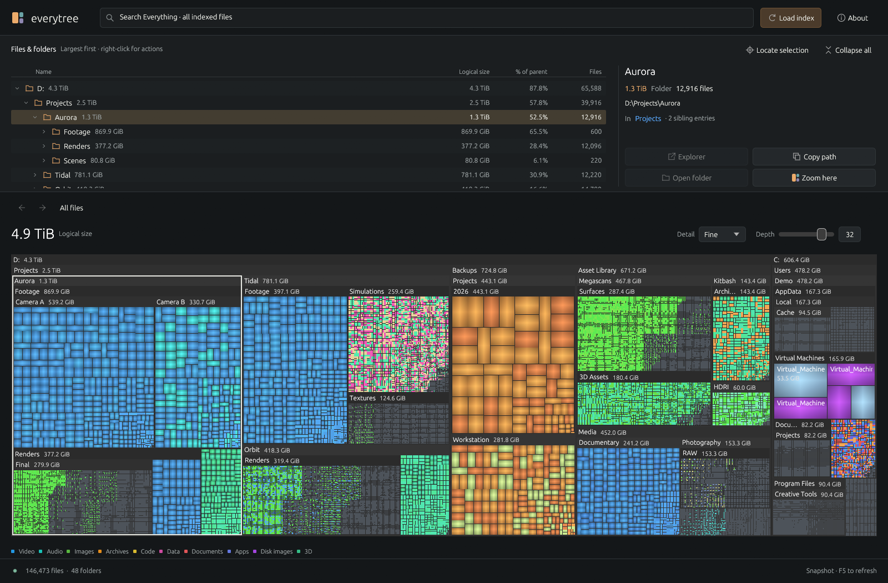

# everytree

A native Rust/egui disk explorer powered by the running [Everything](https://www.voidtools.com/) desktop client. The treemap is rendered by egui through wgpu, navigation and hovering never scan the full file index.



## Usage

- Double-click a folder or grouped treemap region to drill in.
- Single-click a rectangle to reveal and select its row in the filesystem tree above the treemap.
- Expand folders with their arrows. Click a tree row to focus the treemap on that folder or the file's siblings.
- The details pane shows full location, logical size, file type, parent folder, and sibling count. Drag the divider below the filesystem pane to resize it.
- **Back / Forward**, **Mouse 4 / Mouse 5**, or **Alt+Left / Alt+Right** move through folder history, restoring the selected entry too. Backspace and Shift+Backspace also work when not editing text. Breadcrumbs jump to ancestors. Opening another folder after going back clears the old forward branch, just like a browser; a successful index reload starts fresh history.
- **F5** reloads the current source.
- **Depth** supports up to 64 nested levels, starting at 32. Small folders keep expanding without spending space on headers. Screen space and the tile budget still limit detail; zoom into a folder to reveal regions too small to draw.
- **Detail** is separate from depth: **Balanced** uses a 16,000-tile cap and approximately 16 square points per tile; **Fine** (default) uses 75,000 / 4; **Pixel** uses 200,000 / 1. These are grouping thresholds, not a guarantee of an exact tile size. Higher detail costs more CPU/GPU work. Pixels smaller than a screen point and entries beyond the cap remain grouped.
- Folder sizes appear beside names in both the treemap headers and filesystem tree. Long names are shortened to leave room for the size; unknown totals retain their `+ ?` marker.
- Colours are stable by extension, with ten type families, variations within each family, and hashed hues for other extensions. Folder headers are neutral; file tiles have a subtle cushion highlight.
- **About > Diagnostics** contains import, memory, renderer, and layout statistics. The main interface shows file/folder counts and navigation controls.
- **Explorer** opens the parent and selects the item. **Open folder** opens the selected folder or a file's containing folder. Both actions are also available in the right-click menu. Paths with spaces, commas, and Unicode use native Windows shell item IDs.
- Search, **Refresh**, and **About** share a single toolbar. Loading uses a fixed-height footer with reserved columns for the stage, progress, counts, elapsed time, and Cancel. Messages can be dismissed. Vector icons scale with display DPI, and selection actions stay visible while details scroll.
- Right-click tree rows or treemap rectangles for Explorer, copy path, and navigation actions.
- The filesystem tree is virtualized: even a million siblings only create visible rows. Its expanded projection uses compact ranges instead of allocating a row per file.

## Build from source

Requires Windows x64, Rust installed through rustup, and the Visual C++ build tools / Windows SDK. `rust-toolchain.toml` pins Rust 1.98.1 (with rustfmt and Clippy) for local and CI builds; rustup installs and selects it automatically when you run Cargo in this repository.

```powershell
.\scripts\setup.ps1
cargo run --release --locked
```

`scripts/setup.ps1` downloads the official Everything SDK from `https://www.voidtools.com/Everything-SDK.zip` into the ignored `vendor/` directory. Its DLL is dynamically loaded from beside the executable or the development SDK directory. No system installation is performed.

```powershell
.\scripts\build.ps1
```

The build script runs release tests, builds explicitly for Windows x64/MSVC, and places `everytree.exe`, `Everything64.dll`, the icon, and documentation in `dist/<version>/`. It also creates `dist/everytree-<version>-windows-x64.zip` and a matching `.zip.sha256` checksum, then updates the original `dist/` launch path. If that copy is running, the versioned package and ZIP remain available. Run `.\scripts\build.ps1 -Check` to include formatting and Clippy checks, matching CI.

The folder/treemap icon is embedded in the executable and supplied to the app window. A standalone `everytree.ico` is included for shortcuts. The Windows SDK resource compiler is detected automatically; set `RC` to its `rc.exe` path for a custom installation. Packaged artwork and its generation prompt live in [assets/README.md](assets/README.md); Python/Pillow are only needed when regenerating the icon assets.

## CI and GitHub releases

The **CI** workflow runs on branch pushes and pull requests. It checks formatting, runs Clippy with warnings treated as errors, runs the release tests, and builds a portable Windows x64 ZIP. The GPU preview test stays opt-in; the automated tests do not need Everything running. The Windows runner supplies the Visual C++ tools and Windows SDK; the workflow installs the Rust version pinned in `rust-toolchain.toml` and the build script downloads the official Everything SDK. Update that file deliberately when upgrading the compiler; the build cache is separated by toolchain version.

You can also select **Actions > CI > Run workflow** to build a branch manually. Download the `everytree-windows-x64` artifact from the completed run; it contains the portable ZIP and its SHA-256 checksum. Build artifacts are retained for 14 days.

After committing and pushing the project to GitHub, publish the current version with:

```powershell
git tag v0.3.6
git push origin v0.3.6
```

The **Release** workflow requires the tag to match `package.version` in `Cargo.toml` exactly (`v` followed by the version). It runs the same Windows CI checks, verifies the ZIP checksum, and publishes a GitHub Release containing the ZIP and checksum with automatically generated release notes. Versions such as `0.4.0-beta.1` produce prereleases. The built-in `GITHUB_TOKEN` is used; no personal token or repository secret is needed. Only the publishing job receives `contents: write` permission.

For later releases, update the version in `Cargo.toml`, run `cargo check` to refresh the package entry in `Cargo.lock`, and run `.\scripts\build.ps1 -Check`. Commit and push those changes before creating the matching tag. Treat published version tags as fixed; fixes should receive a new version. A failed run can be retried from Actions before its release is published.

If repository or organization policy disables Actions or prevents release creation, enable it for these workflows. The repository must contain these workflow files before the version tag is pushed.

To use a downloaded release, extract the whole portable ZIP and run `everytree.exe`, keeping `Everything64.dll` beside it. Start the Everything desktop client and enable **Tools > Options > Indexes > Index file size**. Builds are currently unsigned.

## Dependencies

The Everything SDK is supplied by voidtools; consult its bundled source headers for its license. Application code is MIT licensed. Rust dependency versions are pinned in `Cargo.lock`.
